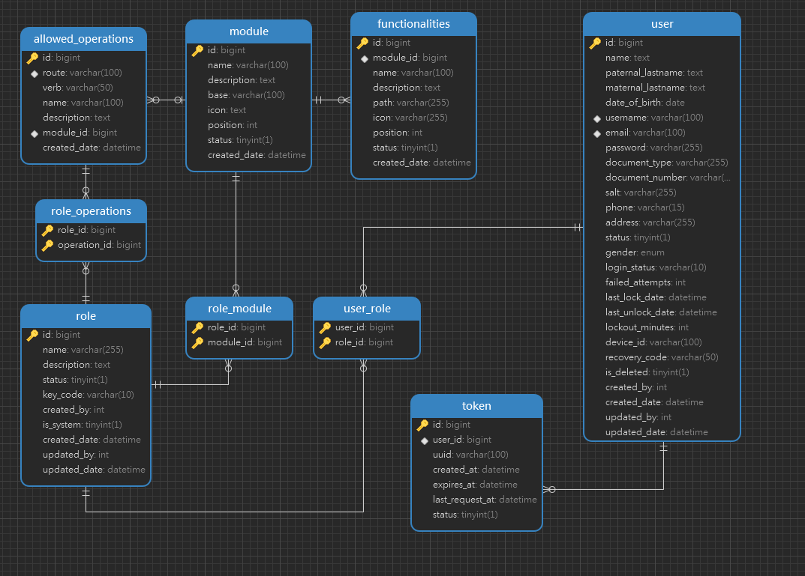

# __Backend Template With Node.Js__

## Introducción
This Node.js and Express project template provides a solid foundation for building scalable and secure applications. It includes authentication via Passport, routing management, email sending, file uploads to AWS S3 storage using the AWS-SDK, password encryption and validation, as well as role-based access control with module-level permissions. Additionally, it uses Sequelize ORM for seamless database management and validation. This template is perfect for anyone looking to start a new project with these essential features, ensuring a well-structured and secure application right from the beginning.


## Tech

- Node.js - Environment
- TypeScript - Base Language
- sequelize - ORM for database interaction
- Multer - File uploads handling
- AWS-SDK - AWS services integration
- Axios - HTTP requests
- Bcrypt - Password hashing
- Express - Web framework
- Passport - Authentication
- Moment - Date and time manipulation


## Main Configuration .env
In the `.env.template` file, there is an example of the environment variables required for the proper functioning of the project. Before starting, these variables must be configured, and the file name should be changed to `.env` so that it can be read. The variables that already have a default value configured can be changed if desired or left as they are.

### Environment Variables

- `NODE_ENV`: The environment in which the application is running development/production
  
- `PROY_APP_PORT`: The port where the application will run.

### Database (DEV)

- `PROY_BD`: The database name.
  
- `PROY_BD_HOST`: The host of the database server.
  
- `PROY_BD_USER`: The database username.
  
- `PROY_BD_PASS`: The password for the database user.
  
- `PROY_BD_PORT`: The port for the database connection.

### Frontend

- `PROY_FEURL`: The URL for the frontend application.

### Backend

- `PROY_BEURL`: The URL for the backend application.

### Secret

- `SECRET_HIDDEN_KEY`: A secret key used for cryptographic operations.

### AWS S3

- `S3_ACCESS_KEY_ID`: The access key for AWS S3.
  
- `S3_SECRET_ACCESS_KEY`: The secret access key for AWS S3.
  
- `S3_ENDPOINT_URL`: The endpoint URL for AWS S3.
  
- `S3_BUCKET_NAME`: The name of the S3 bucket used for storage.

### SendGrid Key

- `SENDGRID_KEY`: The API key for SendGrid, used for email sending.

## Development 

1. ### Clone Repository
2. ### Install Dependencies
This will install the necessary dependencies for the proper functioning of the project.

```sh
npm i
```
3. ### Set Environment Variables .env

4. ### Run Server
Run the command to start the server in DEV mode. This will create the database using Sequelize, insert the necessary data to initialize the project, and create an Admin user for the project. The user's credentials can be found in the code in the directory `src\database\seeder\auth.seeders.ts`, or in a comment in the `.env` file.

```sh
npm run dev
```

## Endpoints

### Auth
* **SignIn:**
  * **Método:** POST
  * **Endpoint:** `/api/signin`
  * **Body:**
    ```json
    {
        "email": "UserEmail",
        "password": "UserPassword"
    }
    ```

* **Send Recovery Code:**
  * **Método:** POST
  * **Endpoint:** `/api/recovery/send-code`
  * **Body:**
    ```json
    {
        "email": "UserEmail"
    }
    ```

* **verify Recovery Code:**
  * **Método:** POST
  * **Endpoint:** `/api/recovery/verify-code`
  * **Body:**
    ```json
    {
        "email": "UserEmail",
        "verificationCode": "RecoveryCode"
    }
    ```

* **Recovery User Account:**
  * **Método:** POST
  * **Endpoint:** `/api/recovery/user-account`
  * **Body:**
    ```json
    {
        "email": "UserEmail",
        "verificationCode": "RecoveryCode",
        "password": "NewPassword"
    }
    ```

### User
* **Crear un usuario:**
  * **Método:** POST
  * **Endpoint:** `/api/users/create`
  * **Body:**
    ```json
    {
        "roles": [],
        "name": "ExampleName",
        "paternal_lastname": "ExampleLastName",
        "date_of_birth": "2000-01-01",
        "email": "email@gmail.com",
        "document_number": "00000000",
        "gender": "MALE",
        "phone": "000000000"
    }
    ```


* **List Users:**
  * **Método:** GET
  * **Endpoint:** `/api/users/list`
  * **Query Params:**
  | Param | Type | Description | Optional |
    |---|---|---|---|
    | page | number | Number Page | Yes |
    | limit | number | Limit Page | Yes |
    | search | string | search term | Yes |
    | order | string | order ASC/DESC  | Yes |
    | column | string | search column | Yes |

* **Get User By ID:**
  * **Método:** GET
  * **Endpoint:** `/api/users/find/:id`

* **Update User By ID:**
  * **Método:** PUT
  * **Endpoint:** `/api/users/updape/:id`
  * **Body:**
    ```json
    {
      "roles": [],
      "name": "ExampleName",
      "paternal_lastname": "ExampleLastName",
      "email": "email@gmail.com",
      "document_number": "00000000",
      "phone": "000000000"
    }
    ```

* **Enable/Disable User By ID:**
  * **Método:** PUT
  * **Endpoint:** `/api/user/disable/:id`

* **Get User Data From Token:**
  * **Método:** POST
  * **Endpoint:** `/api/user/user-account`

### Module
* **Crear un usuario:**
  * **Método:** POST
  * **Endpoint:** `/api/users/create`
  * **Body:**
    ```json
    {
        "roles": [],
        "name": "ExampleName",
        "paternal_lastname": "ExampleLastName",
        "date_of_birth": "2000-01-01",
        "email": "email@gmail.com",
        "document_number": "00000000",
        "gender": "MALE",
        "phone": "000000000"
    }
    ```


* **List Users:**
  * **Método:** GET
  * **Endpoint:** `/api/users/list`
  * **Query Params:**
  | Param | Type | Description | Optional |
    |---|---|---|---|
    | page | number | Number Page | Yes |
    | limit | number | Limit Page | Yes |
    | search | string | search term | Yes |
    | order | string | order ASC/DESC  | Yes |
    | column | string | search column | Yes |

* **List My Modules:**
  * **Método:** GET
  * **Endpoint:** `/api/role_module/list/my-modules`
  
* **List Modules By Role ID:**
  * **Método:** GET
  * **Endpoint:** `/api/role_module/list/operations/role/1`

### Role
* **Create Role:**
  * **Método:** POST
  * **Endpoint:** `/api/role/create`
  * **Body:**
    ```json
    {
        "name": "NewRole",
        "description": "role description"
    }
    ```


* **List All Roles:**
  * **Método:** GET
  * **Endpoint:** `/api/role/list`
  * **Query Params:**
  | Param | Type | Description | Optional |
    |---|---|---|---|
    | page | number | Number Page | Yes |
    | limit | number | Limit Page | Yes |


* **Get User By ID:**
  * **Método:** GET
  * **Endpoint:** `/api/users/find/:id`

* **Update Role:**
  * **Método:** PUT
  * **Endpoint:** `/api/role/update/:id`
  * **Body:**
    ```json
    {
        "name": "NameRole",
        "description": "DescriptionRole"
    }
    ```

* **Enable/Disable Role By ID:**
  * **Método:** PUT
  * **Endpoint:** `/api/role/disable/:id`
  
## Relational Diagram





